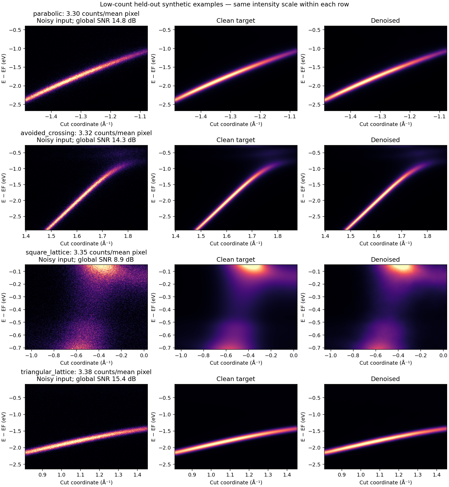
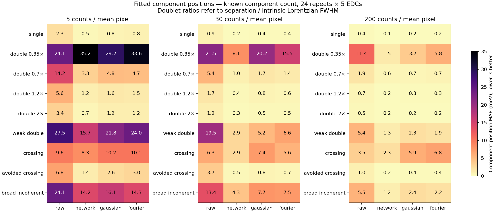
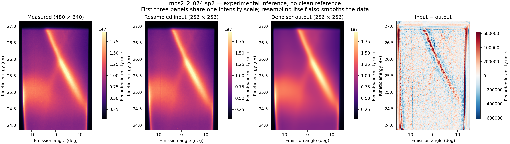
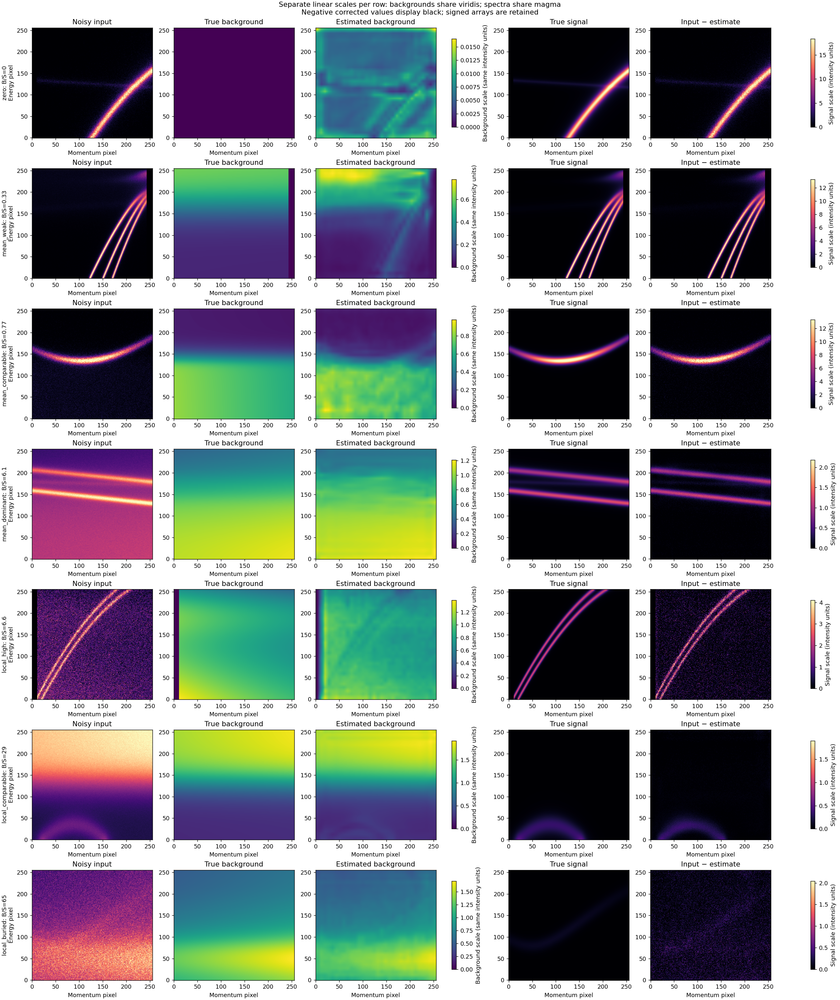
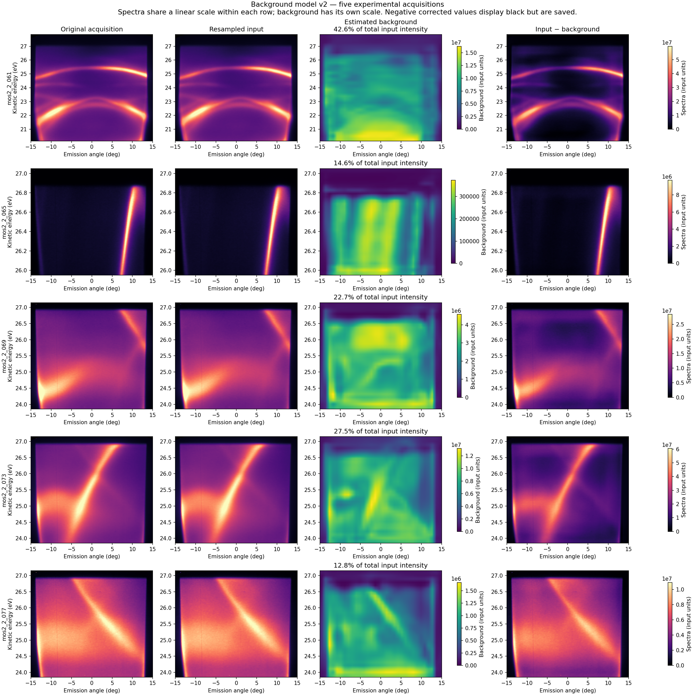

# ARPES denoising with synthetic training data

A small PyTorch project for removing counting noise from angle-resolved photoemission spectroscopy (ARPES) images. It generates its own training pairs from spectral-function models, trains a compact residual U-Net, and evaluates whether the output is useful for **fitting bands**, not just making prettier pictures.

The denoiser aims to preserve the measured line shape: self-energy broadening, renormalization and instrumental resolution belong in the clean target. **It is not a band-sharpening or self-energy-removal tool.**



*Held-out synthetic examples, with matched intensity scales within each row. These are predictions from the trained model, not illustrations.*

## What is here?

- A vectorized spectral-function simulator with randomized bands, measurement windows, resolution, backgrounds and counting statistics.
- A compact, intensity-only U-Net with separate training and inference scripts.
- A reader for corrected SPECS `.sp2` images, plus NumPy input for your own data.
- Reproducible comparisons with tuned Gaussian and Fourier filters, including overlapping-band fits and single-band controls.
- An honest record of successes and failure cases. This is a personal exploratory project, not a validated analysis standard or a paper implementation.

**Status:** the reference model completed 50 GPU epochs. Synthetic benchmarks are encouraging; experimental accuracy has not been established using independent high-statistics references. Code and curated figures are intended for the repository. Large datasets, model checkpoints, raw measurements and labbooks are excluded from Git.

## Get started

Use Python **3.12** and [uv](https://docs.astral.sh/uv/). Run commands from the repository root:

```bash
git clone https://github.com/NEhlen/ARPES_NN.git
cd ARPES_NN
uv sync --locked --extra dev
uv run python arpesnn/demo.py --output outputs/demo
```

The demo generates a noisy spectrum, its clean reference and a comparison plot without needing a checkpoint or experimental data. It does **not** run denoising unless you supply `--checkpoint`. The project is a collection of scripts; there is no installed Python API or console entry point yet.

### Train a small model first

This smoke run verifies the pipeline; it will not reproduce the reference results:

```bash
uv run python arpesnn/corpus.py --output arpesnn/dataset/smoke \
  --train 40 --validation 10 --test 10 --ood 10 --size 64 --workers 2
uv run python arpesnn/train_tasks.py --corpus arpesnn/dataset/smoke \
  --output arpesnn/models/smoke --task denoise \
  --epochs 2 --batch-size 8 --workers 0
```

Training uses CUDA when available and otherwise CPU. Add `--require-cuda` for a full run if you want it to fail rather than silently use CPU. The reference model was trained on 256 × 256 images; a 64 × 64 smoke model is only a pipeline check.

### Denoise an image

Use your trained checkpoint, or download the [reference denoiser from the v0.1.0 prerelease](https://github.com/NEhlen/ARPES_NN/releases/download/v0.1.0/arpes-denoiser-v1.tar.gz). The downloaded model uses a 256 × 256 grid; use its `denoiser.pt` with `--size 256`, rather than the 64 × 64 smoke-model settings below.

```bash
uv run python arpesnn/denoise.py \
  --input outputs/demo/noisy.npy \
  --checkpoint arpesnn/models/smoke/denoise/best_model.pt \
  --size 64 --device cpu --output outputs/smoke-prediction
```

For a 256 × 256 model, omit `--size`. A NumPy input must be a finite, nonnegative 2D array with **energy along rows** and momentum/angle along columns. The same command accepts corrected `.sp2` files. Raw detector blocks need instrument correction first.

Outputs are `denoised.npy`, `prediction.npz` (original, resampled input, prediction and residual), a shared-scale plot, and metadata with the checkpoint hash. **Predictions are returned in the input's intensity units, on the model grid.** Resizing itself smooths data; interpolation back to the acquisition size would not restore resolution. Negative background-subtracted spectra are outside this model's training distribution and are rejected.

For experimental use, inspect residuals and EDC/MDC line shapes. Keep the original acquisition. Smoother is not automatically more accurate.

## How it works

Synthetic measurements follow the usual spectral-function construction:

```text
band dispersions + complex self-energy
  → spectral intensity × Fermi occupation × intensity envelope + background
  → instrument broadening and pixel integration
  → clean target
  → Poisson counting noise → network input
```

The simulator includes 12 toy band families, from parabolas and Dirac cones to avoided crossings, bilayer-like models and lattice dispersions. Momentum cuts and energy windows vary independently of the zone center. Intensity envelopes may be symmetric or asymmetric; their asymmetry is explicitly sampled, not necessarily a broken symmetry of the Hamiltonian.

The self-energy is a causal phenomenological retarded-pole model. The bands, matrix-element-like envelopes and backgrounds are controlled approximations, not material-specific first-principles calculations. See [simulation and training details](docs/TRAINING.md).

### The network

A **two-level residual U-Net (118,625 trainable parameters)**, with channel widths **16 → 32 → 64**, skip connections, two 3 × 3 convolutions per block, GroupNorm and SiLU activations. Downsampling uses average pooling; upsampling uses bilinear interpolation. A 1 × 1 output head predicts a correction to the noisy input, followed by nonnegative clipping. The head starts at zero, so initial inference is the identity operation.

Input and clean target share the noisy input's mean-intensity normalization. The model sees intensity only—no energy/momentum coordinates, material labels or explicit noise estimate. Consequently, pixel scale and acquisition characteristics matter.

| Reference training setting | Value |
|---|---|
| Image size | 256 × 256 |
| Training / validation / test / unseen-family configurations | 10,000 / 1,000 / 1,000 / 1,000 |
| Training noise | Fresh Poisson draw each epoch; roughly 3–2,000 counts per mean pixel |
| Augmentation | Random horizontal reflection |
| Objective | Mean squared error to the noise-free, broadened intensity |
| Optimizer | AdamW; learning rate 3 × 10⁻⁴; weight decay 10⁻⁴ |
| Batch size / maximum epochs | 32 / 50 |
| Schedule | Halve learning rate after 3 plateau epochs; early-stop patience 8 |
| GPU | NVIDIA RTX 4060 Ti, 16 GB; mixed precision |

The reference run trained the denoiser and an independent experimental bare-band model together in approximately **79 minutes**. That is not a denoising-only timing estimate. [Model card](docs/MODEL_CARD.md) · [Full reproduction commands](docs/TRAINING.md)

## Does it help?

### Reconstructing clean synthetic intensity

Filters were tuned on validation data, with separate energy/momentum settings and noise-level bins. On independent test configurations:

| Method | Test MSE ↓ | Unseen-family MSE ↓ |
|---|---:|---:|
| Noisy input | 0.04884 | 0.05165 |
| Tuned Gaussian | 0.01971 | 0.02096 |
| Tuned Fourier low-pass | 0.01576 | 0.01669 |
| **Network** | **0.00094** | **0.00096** |

Mexican-hat and saddle families were excluded from training and validation, but still share the simulator's noise and acquisition assumptions. This is not a demonstration of generalization to arbitrary experiments, nor a comparison with every conventional denoising algorithm.

### Fitting overlapping bands

Image MSE is not the scientific objective. A second benchmark uses **648 test images**: nine configurations, three count levels and 24 independent noise realizations each. It fits individual Voigt components, including weak overlapping bands and crossings, and separately checks false splitting on single-band controls. Filter settings were retuned for fitted position and linewidth errors.

At 30 counts per mean pixel, fitted component-position errors were:

| Case | Raw | Gaussian | Fourier | Network |
|---|---:|---:|---:|---:|
| Close doublet, separation = 0.7 × intrinsic FWHM | 5.40 | 1.70 | 1.44 | **1.04 meV** |
| Weak component, 15% of strong component area | 19.55 | 5.18 | 6.62 | **2.86 meV** |
| Avoided crossing | 3.73 | 0.78 | 0.65 | **0.47 meV** |



**Important failures:** at the lowest count level, the closest doublet still produces catastrophic fits; the network's observed mean error is worse than the alternatives. Forcing two components near a crossing can create an apparent gap. Ordinary least-squares error bars after processing are overconfident: nominal 95% intervals covered close-doublet centers only about **39%** of the time for the network at the middle count level.

These tests supply the true component count for position/width scoring; deciding whether two components are present is evaluated separately. The fitting model matches the simulated line shapes, so this remains a favorable controlled setting. [Benchmark methods, results and limitations](docs/BENCHMARKS.md) · [Example EDC fits](docs/figures/edc-fits.png)

### Experimental preview



*A local SP2 acquisition processed by the reference model. The first three panels share one intensity scale. The residual contains band structure as well as noise, demonstrating that processing changes signal too. No clean experimental reference is available; this figure is a qualitative preview, not proof of improved accuracy. Raw acquisitions and labbook scans are not distributed.*

## Where it is useful—and where to be careful

**Advantages:** no paired experimental training data required; small network; synthetic generation is fast and reproducible; good results on tested synthetic line shapes; improved fitting of many overlapping components.

**Limitations:** synthetic-to-experimental mismatch; only Poisson noise in training; no comprehensive detector-artifact model; possible suppression or distortion of weak features; dependence on pixel scale and resizing; poorly calibrated fit uncertainties after processing. The broad-component stress test is not a full microscopic waterfall model. Independent short/long acquisitions would provide a stronger experimental evaluation.

Use it as an exploratory preprocessing tool. Validate a quantitative result against raw-data fits and independent measurements. A denoised image does not establish a splitting, gap or self-energy by itself.

## Repository map

| File | Purpose |
|---|---|
| `arpesnn/demo.py`, `denoise.py` | Small synthetic demo and denoising inference |
| `arpesnn/corpus.py`, `band_models.py` | Synthetic configurations and targets |
| `arpesnn/compact_model.py`, `train_tasks.py` | Reference network and training |
| `arpesnn/sp2.py` | Corrected SP2 loading |
| `arpesnn/background_data.py`, `train_background.py`, `apply_background.py` | Separate background simulation, training and inference |
| `arpesnn/benchmark_denoising.py` | Validation-tuned image reconstruction benchmark |
| `arpesnn/benchmark_overlap.py`, `report_overlap.py` | Downstream component-fitting benchmark |
| `docs/` | Model card, methods, figures and compact numeric results |
| `tests/` | CPU regression tests; no local measurements required |

The older `generate_data.py`, `generate_tasks.py`, `nn_pytorch.py` and `apply_model.py` workflows are retained for historical compatibility. The tracked `example_dataset` is a **legacy bare-band example**, not a denoising training set. The separate bare-band/self-energy-removal experiment remains exploratory; it is not the recommended workflow. Old plotting helpers reference the original local run and are not required for the quickstart.

## Separate experiment: background estimation

An optional [background estimator](docs/BACKGROUND.md) predicts a smooth nonnegative additive background and saves both the estimate and the signed corrected spectrum. **Subtraction leaves counting noise and is different from denoising.** Intrinsic broadening and broad/weak spectral features remain part of the synthetic signal target.

The new **v2 checkpoint** was trained with balanced background strength and local band contrast, including backgrounds 2–20 times stronger than the local band signal. On identical harder synthetic test images, mean relative subtraction error around bands decreases from **0.431 for v1 to 0.106 for v2**. That metric is background-estimation RMS error divided by true signal RMS in signal-defined ridge neighbourhoods, averaged over images.

There are useful fitting improvements: under locally comparable backgrounds, close-doublet center error falls from **59.6 to 3.6 meV**, and weak-doublet error from **29.0 to 4.9 meV**. But a buried close doublet still has about **100 meV** error, some easier cases regress, and band-shaped artifacts remain in background estimates. This is an exploratory baseline, **not reliable band-preserving subtraction**.



*Held-out synthetic examples, from zero background at the top to locally buried bands at the bottom. Columns show noisy input, true background, estimated background, true signal and subtraction. True and estimated backgrounds share a separate labelled scale within each row; spectra share the input scale. Rows are the first example of each regime, not selected for prediction quality. Negative corrected values display black but remain in the numerical output.*



*Five evenly spaced acquisitions from the available local filename sequence (061, 065, 069, 073, 077), chosen before inference. Each row shows original acquisition, resampled input, estimated background and subtraction. Spectra share a scale within each row; backgrounds use a separate labelled scale. About 13–43% of integrated intensity is subtracted. That is a model estimate, not a measured extrinsic fraction. Band-like structures in the estimates indicate possible signal removal. No experimental decomposition ground truth is available; these are acquisitions from one session, not five materials.*

[New synthetic examples](docs/figures/background-v2-test-v2.png) · [Old model on identical examples](docs/figures/background-v2-test-v1.png) · [Model, commands and complete results](docs/BACKGROUND.md) · [v0.2.0 release notes](docs/RELEASE_NOTES.md)

The background checkpoint is prepared as a separate release attachment. Until v0.2.0 is published, use your own trained checkpoint or a locally prepared archive; no background download URL is assumed. With the extracted background archive:

```bash
uv run python arpesnn/apply_background.py --input /path/to/spectrum.sp2 \
  --checkpoint /path/to/arpes-background-v2/background.pt \
  --output outputs/background-preview
```

Keep the original and estimated background. Do not pass signed corrected arrays directly into the denoiser: it expects nonnegative measurements, and a combined pipeline has not been validated. The v1 background model remains documented for comparison; it is not the primary background asset for this release.

## Development and reuse

```bash
uv run python -m unittest discover -s tests -v
uv run black --check arpesnn tests
```

CPU CI tests the synthetic pipeline and a small training/inference run. Contributions that improve experimental validation, noise realism, uncertainty estimation or reproducibility are particularly useful; see [CONTRIBUTING.md](CONTRIBUTING.md).

**License:** [MIT](LICENSE), including the project code, documentation and prepared pretrained weights. See [publication notes](docs/PUBLISHING.md) for optional weight distribution.
