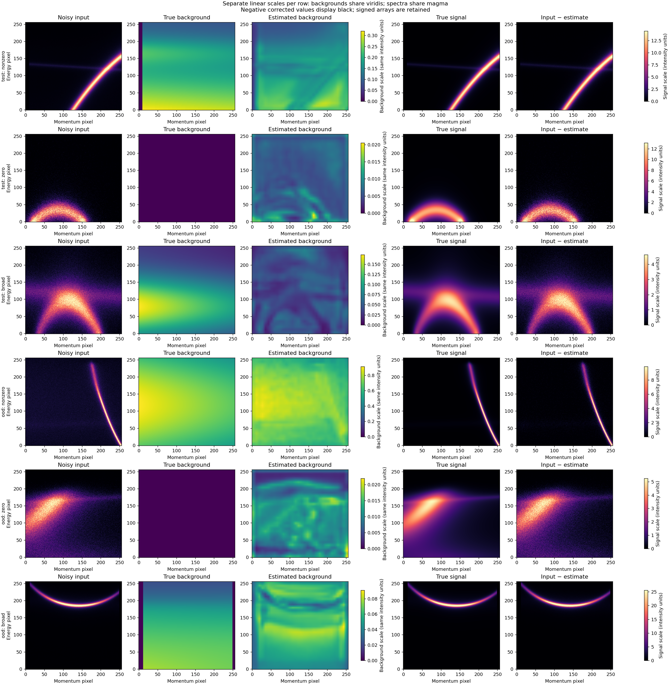
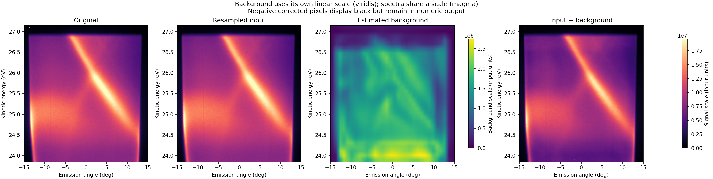

# Model card and guide: additive-background estimation

This is a separate experiment from the released denoiser. The v0.2.0 release candidate uses the v2 background checkpoint; v1 results below are retained as the original reference. It estimates a nonnegative additive background and saves it separately:

```text
corrected = measured input − estimated background
```

The corrected array is **signed and not clipped**. Background subtraction does not remove the counting noise generated by the background, and does not infer a bare band. Existing denoiser and bare-band checkpoints are unchanged.

## Training target

The existing spectral-function simulator can now omit its small additive background via `simulate(..., include_background=False)`. Its default behavior remains unchanged. All self-energy broadening, instrumental resolution and spectral intensity remain signal. Additional broad, nearly flat components and weak components are explicitly retained as signal, not labelled as background.

The background task adds independent constant/tilted/hump/step surfaces and illustrative signal-correlated loss-like energy tails. Twenty percent of draws have exactly zero background. Nonzero background/signal mean ratios span roughly 0.02–3.16; counting statistics span roughly 3–2,000 counts per mean pixel. These are deliberately broad synthetic assumptions, not a calibrated microscopic loss model or an assertion that such a decomposition is identifiable in real data.

Background shape, amplitude and Poisson noise refresh each training epoch. Validation and test realizations are fixed. Training/validation/test use distinct signal configurations and seed ranges; Mexican-hat and saddle signals are reserved for the unseen-family split.

## Model and objective

`BackgroundNet` uses a newly initialized compact U-Net internally. It resamples normalized input to 128×128, predicts a nonnegative field, pools it to 32×32, then bilinearly interpolates to the input grid. The coarse representation discourages narrow-band subtraction but cannot protect broad intrinsic features by construction. No bare-band weights or denoiser weights initialize this model.

The target is the known additive background divided by the same noisy-input mean. Training minimizes background MSE; zero-background controls receive four times the sample weight to penalize unnecessary subtraction. AdamW, validation-plateau scheduling, gradient clipping, mixed precision and early stopping follow the denoising workflow. The current experiment uses 8,000 training signals and 1,000 each for validation, test and unseen-family evaluation; maximum 40 epochs, batch 32.

## Reference run and results

The `background_v1_20260920` run completed **40 epochs** on an RTX 4060 Ti (16 GB), selecting **epoch 37** by weighted validation MSE (0.005284). Training took about 8.4 minutes; training plus automatic analysis took about 9 minutes on this machine. Inputs were 256×256, with internal 128×128 processing and a 32×32 background field. AdamW used learning rate 0.0003 and weight decay 0.0001; plateau patience 3, early-stop patience 7 and gradient norm limit 1. The model has no coordinate, material or uncertainty inputs.

| Held-out metric | No subtraction | Network | Lower envelope |
|---|---:|---:|---:|
| Test background MSE | 0.12234 | 0.00581 | 0.05313 |
| Unseen-family background MSE | 0.12374 | 0.00628 | 0.08096 |
| Test zero-background signal removed | 0% | 1.1% | 9.2% |
| Test absolute integrated-area error | 48.45% | 4.57% | 18.73% |

MSE uses the shared noisy-input mean normalization, not raw detector units. The baseline is the 5th momentum percentile per energy row followed by energy smoothing, selected from four quantiles on validation. It is one conventional baseline, not every physical background model. Absolute integrated-area error is the per-image absolute difference in total estimated versus true background divided by total true signal; it does not measure local shape fidelity. Test signed area bias is only +0.027%, but positive and negative errors can cancel.



Background panels use a separate linear color scale shared by truth and estimate in each row, spanning their joint maximum. Spectrum panels share the input’s 99.5th-percentile scale. Separate colorbars retain intensity units; different colors must not be compared as equal intensities. Zero-background controls use the same truth/estimate scale, exposing false subtraction.

### Does subtraction improve band fits?

The separate stress test uses 144 images: four fixed signal cases, three background types and twelve noise draws per condition, at 30 counts per mean signal pixel. Five EDCs per image share a noise realization. Selected center mean absolute errors (meV):

| Signal / background | Raw | Network | Lower envelope | Exact-background subtraction |
|---|---:|---:|---:|---:|
| Close doublet / correlated | 3.16 | 2.05 | 2.59 | 2.45 |
| Broad component / correlated | 58.56 | 11.37 | 24.33 | 6.54 |
| Single band / hump | 0.52 | 0.84 | 2.44 | 0.44 |
| Weak doublet / hump | 5.68 | 5.69 | 14.66 | 5.30 |

The table deliberately includes gains and failures. The close-doublet correlated case also improves width error from 8.70 to 4.65 meV and area error from 36.4% to 14.9%. Weak-doublet/hump area error remains about 77%. Exact-background subtraction retains noise; nonlinear fitting and finite samples can let an imperfect estimator score better in a particular metric. That is not evidence of a physically better decomposition than the known background.

[All image metrics](results/background.json) · [All fitting metrics](results/background-fits.json) · [Portable run metadata](results/background-training.json) · [Stress-test examples](figures/background-fit-examples.png)

### Experimental preview



The same corrected SP2 acquisition used in the denoising preview is shown before and after resampling, with its estimated background and signed corrected image. Estimated background is about 14.9% of the resampled input's integrated intensity. This is a model output, not a measured extrinsic fraction. The background has its own labelled linear scale (viridis), while the original, resampled and corrected spectra share the signal scale (magma); negative corrected values display black but are retained numerically. Raw measurements are not distributed.

### Intended use and limits

Use this as an inspectable hypothesis for additive-background subtraction. It cannot identify intrinsic versus extrinsic weight from intensity alone, guarantee unchanged bands, or recover bare dispersions. Smooth broad signal can resemble the training backgrounds. Retained broad/weak controls help but do not resolve that ambiguity. Poisson-only noise, synthetic shapes, image resizing and detector/domain mismatch limit transfer to experiments. No calibrated uncertainty estimate is produced.

Preserve the input and estimated background, compare fits with raw-data fits, and check weak/broad features explicitly. **Do not feed signed corrected arrays directly into the existing denoiser**: they are outside its nonnegative training distribution. A combined pipeline needs its own evaluation.

## Commands

Use new output directories:

```bash
uv run python arpesnn/background_data.py --output arpesnn/dataset/background \
  --train 8000 --validation 1000 --test 1000 --ood 1000 --workers 8
uv run python arpesnn/audit_background.py arpesnn/dataset/background
uv run python arpesnn/train_background.py --corpus arpesnn/dataset/background \
  --output arpesnn/models/background --epochs 40 --batch-size 32 --workers 4 --require-cuda
```

Training automatically runs analysis after selecting the best validation checkpoint. An optional `--experimental /path/to/spectrum.sp2` adds an experimental preview. `start_background.py` accepts the same corpus/output/epochs/batch-size/workers/experimental options and launches a detached GPU process, with a log and launch record beside the output directory. `status.json` transitions through training, analyzing and complete, or records a failure. Use the foreground trainer with `--resume` to restore the last completed epoch; source and corpus settings must match. If analysis output already exists on resume, a separate analysis directory is used.

For a quick CPU pipeline test, generate a small corpus with `--size 64` and use two training epochs plus `--skip-analysis-stress`. The model internally still uses a 128×128 grid. A smoke run tests execution only.

Inference and separate analysis:

```bash
uv run python arpesnn/apply_background.py --input /path/to/spectrum.sp2 \
  --checkpoint arpesnn/models/background/best_model.pt --output outputs/background-preview
uv run python arpesnn/analyze_background.py --corpus arpesnn/dataset/background \
  --checkpoint arpesnn/models/background/best_model.pt --output outputs/background-analysis
```

Inference accepts corrected SP2 and nonnegative 2D `.npy` arrays. It exports the original input, resampled input, estimated background and signed corrected image in `decomposition.npz`, in input intensity units. The display clips negative values to black only for plotting. They remain in the numeric output. Raw SP2 blocks must be corrected first; no Fermi-level or momentum calibration is invented.

## Automatic evaluation

- Background MSE, corrected-image MSE, signed and absolute signal-area error, and negative corrected-pixel fraction on both held-out splits.
- Separate zero-background, broad-component and weak-component groups. Zero-background samples directly measure false signal removal.
- No-subtraction baseline and a conventional momentum lower-quantile background, smoothed along energy. The latter's quantile is tuned on validation data only.
- Independent Voigt fitting stress cases: single, overlapping doublet, weak doublet and broad incoherent component; zero/hump/correlated backgrounds; twelve independent noise realizations of each fixed case/background. Five EDCs per realization are correlated, not independent experiments.
- Raw, network-subtracted, conventional-subtracted and exact-background-subtracted spectra are fitted for component centers, intrinsic widths and integrated areas. The exact-background baseline still contains shot noise and is not a clean denoised spectrum.
- Experimental preview is qualitative, with no ground-truth decomposition.

The generator labels the desired separation. Good synthetic performance does not establish that the same separation is physically correct experimentally. Compare the predicted background itself with the input, and look for recognizable signal removed from weak or broad features.

## Future question: can the “background” contain useful physics?

Yes. “Background” is an analysis label, not a universal physical category. Extrinsic photoelectron scattering can contribute removable intensity ([Kaminski et al.](https://arxiv.org/abs/cond-mat/0311451)); intrinsic incoherent spectral weight can also be linked to dispersive weight and interactions ([Wang et al.](https://arxiv.org/abs/0910.2787)). These papers concern particular cuprate measurements, not a general classification of every broad feature.

A useful future direction would retain and jointly model the full spectrum across temperature, photon energy, polarization or doping. Candidate goals include distinguishing how coherent and incoherent weight change, testing causal self-energy models against full line shapes, and learning low-dimensional patterns in continua. Matrix elements and extrinsic losses would need explicit treatment; held-out experimental conditions and uncertainty checks would be essential.

AI can help fit and compare such high-dimensional models. It cannot make a decomposition identifiable from a single image when multiple physical explanations produce the same intensity. This experiment therefore preserves the estimated background and original measurement as data products rather than treating them as disposable.

## Second experiment: balanced strength and local contrast

The `--profile v2` training option reuses the same clean signal corpus and split boundaries, but changes the on-the-fly acquisition distribution. The original `v1` profile remains the default for reproducibility. Every training epoch rotates each signal through seven equally represented regimes (up to rounding):

| Regime | Controlled quantity | Log-uniform range |
|---|---|---|
| Zero | Background | Exactly zero |
| Mean weak | Mean background / mean signal | 0.05–0.5 |
| Mean comparable | Mean background / mean signal | 0.5–2 |
| Mean dominant | Mean background / mean signal | 2–10 |
| Local high contrast | Median signal / background in ridge neighbourhood | 2–10 |
| Local comparable | Same local ratio | 0.5–2 |
| Local buried | Same local ratio | 0.05–0.5 |

The signal-only ridge neighbourhood comprises pixels at least half of the maximum signal in their momentum column, excluding columns whose peak is below 10% of the image's strongest peak. It is a reproducible local-contrast proxy, not a component-resolved measure: a weak overlapping component can have lower contrast than this statistic suggests. Integrated and local ratios are coupled through the signal/background shape; they are alternative sampling strata, not two independently prescribed targets. Local-contrast strata can produce integrated ratios above 10.

V2 also samples about 3–2,000 **total** expected counts per mean image pixel, rather than counts per mean signal pixel. Thus a larger background reduces the fraction of counts carrying band information. Both distribution and count-budget definition change in this experiment; a comparison cannot attribute differences to amplitude balancing alone. The existing retained broad/weak components and overlapping band families are reused; they remain phenomenological approximations.

Architecture, loss, clean signals and initial training seed stay the same for this comparison. The new checkpoint does not replace the original release candidate automatically. Stronger-background training may improve difficult cases while degrading clean or weak-background cases.

```bash
uv run python arpesnn/train_background.py \
  --corpus arpesnn/dataset/background_v1_20260920 \
  --output arpesnn/models/background-v2 --profile v2 \
  --epochs 40 --batch-size 32 --workers 4 --require-cuda
uv run python arpesnn/compare_background.py \
  --corpus arpesnn/dataset/background_v1_20260920 \
  --old arpesnn/models/background_v1_20260920/best_model.pt \
  --new arpesnn/models/background-v2/best_model.pt \
  --output outputs/background-v2-comparison --device cuda
```

Replace the corpus path with your own background signal corpus when reproducing. Training automatically evaluates using the checkpoint's sampling profile. The comparison evaluates both checkpoints on identical fixed v1 and v2 draws, tunes the conventional baseline on each profile's validation split, and reports each v2 regime separately. It includes mean and 90th-percentile subtraction error in signal-defined ridge neighbourhoods and integrated-area error. These measure local distortion more directly than image MSE, but do not replace component fits or experimental validation. Regime figures use the first encountered example of each regime, independently of prediction quality.

The v2 comparison additionally runs four component-fitting cases with zero, locally comparable and locally buried backgrounds: twelve independent noise realizations per condition at 300 total expected counts per mean pixel. Background shapes/amplitudes are fixed within each condition. Both networks, raw input, a validation-tuned lower-envelope baseline and exact-background subtraction receive identical noise realizations. Five EDCs per image are fitted; their errors are correlated. The benchmark supplies the true component count and matching line-shape family, so it remains a favorable synthetic fitting test.

### Completed v2 results

The 40-epoch v2 run selected **epoch 36** by validation loss. Training took about 8.8 minutes on the same GPU. On identical harder held-out test images, mean relative ridge subtraction error decreased from **0.431 to 0.106**. This is the per-image RMS background-estimation error in signal-defined ridge pixels divided by true signal RMS there, then averaged across images. Lower is better; zero means exact background subtraction.

| V2 test regime | V1 model | V2 model |
|---|---:|---:|
| Zero background | 0.006 | 0.008 |
| Weak integrated background | 0.017 | 0.018 |
| Comparable integrated background | 0.047 | 0.044 |
| Dominant integrated background | 0.158 | 0.079 |
| High local contrast | 0.042 | 0.034 |
| Comparable local signal/background | 0.276 | 0.104 |
| Locally buried signal | 2.488 | 0.456 |

The old v1 test distribution is essentially unchanged in aggregate: ridge error 0.023 → 0.024 and integrated-area error about 4.6% for both models. On the harder unseen-family split, overall ridge error falls from 0.416 to 0.115. Weak/zero-background cases show small regressions, and band-shaped errors remain visible. The buried regime still has an average absolute integrated-area error of **268% of true signal area** with v2, despite much better background MSE. Small fractional errors in a dominant background can overwhelm the much smaller signal.


[The old model on these same examples](figures/background-v2-test-v1.png). Example rows are fixed by regime and dataset order, not selected by performance. Colorbar limits may differ between the two figures. The true-signal panels share the measured-input scale, so very faint true signals can look dark.

The stronger-background fitting test also shows gains and failures. Center MAE in meV:

| Case / local contrast regime | V1 | V2 | Exact background |
|---|---:|---:|---:|
| Single / comparable | 1.69 | 2.63 | 0.64 |
| Close doublet / comparable | 59.58 | 3.62 | 3.55 |
| Weak doublet / comparable | 29.03 | 4.91 | 6.31 |
| Broad component / comparable | 165.04 | 37.46 | 21.63 |
| Single / buried | 109.70 | 68.71 | 3.49 |
| Close doublet / buried | 103.90 | 99.99 | 16.47 |
| Weak doublet / buried | 151.24 | 48.06 | 10.94 |
| Broad component / buried | 126.06 | 59.80 | 24.41 |

Exact-background subtraction retains shot noise. A finite-sample nonlinear fitting score can occasionally favor an imperfect estimate over exact subtraction; this is not evidence that the estimate is more physically correct. Background shape is fixed within each case/regime; twelve noise repetitions do not establish performance across all background shapes. No confidence-interval or experimental-accuracy claim is made.

**Conclusion:** balancing background strength and local contrast improves the tested strong-background regime, but does not solve band-preserving subtraction. The buried-band failures remain substantial. This is an improved exploratory baseline, not a validated replacement for raw-data analysis.

[Full paired metrics including 90th percentiles](results/background-v2-comparison.json) · [All fit metrics and methods](results/background-v2-fits.json) · [Fit conditions](results/background-v2-fit-conditions.json) · [Sampling audit](results/background-v2-sampling.json) · [Training metadata and checkpoint hashes](results/background-v2-training.json)

### Five experimental acquisitions with v2


Files 061, 065, 069, 073 and 077 were selected by evenly spaced filename order before inference, from the same local session. They are not independent materials. Estimated integrated background fractions are 42.6%, 14.6%, 22.7%, 27.5% and 12.8%, respectively. These are predictions, not calibrated extrinsic fractions. Visible band-shaped structure in several background panels is a warning about signal removal. No clean experimental decomposition is available. Raw acquisitions remain private. [Compact preview metadata](results/background-v2-experimental.json).
