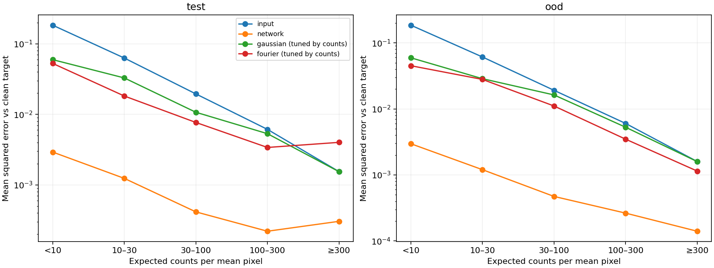
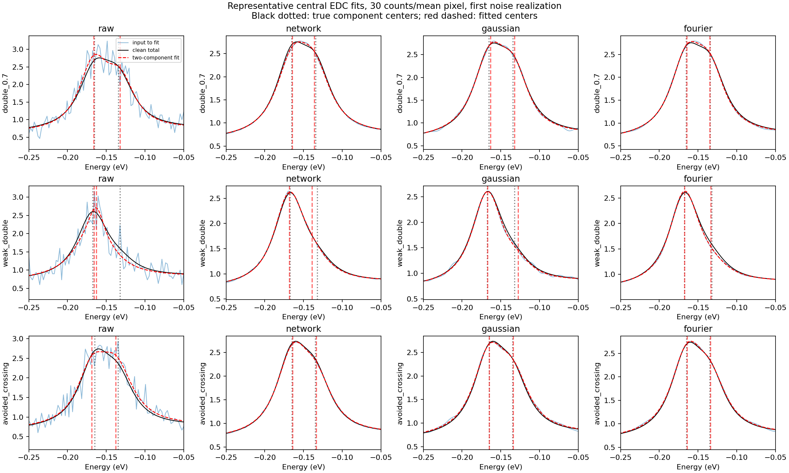

# Denoising benchmarks

Two questions are evaluated separately: reconstructing clean synthetic intensity and recovering parameters from overlapping spectra. Neither is an experimental validation.

## Clean-intensity reconstruction

The network and conventional filters receive identical noisy inputs and are scored against the same clean intensity. The reference test contains 1,000 configurations; a further 1,000 use held-out Mexican-hat and saddle families.

64 Gaussian settings and 98 smooth Fourier low-pass settings were tuned on 1,000 validation examples. Gaussian widths and Fourier cutoffs vary along both axes. The Fourier filter uses an even extension (DCT-II) to avoid wraparound, with response `1 / (1 + ((fy/cy)^2 + (fx/cx)^2)^order)`. Negative output is clipped. This is a particular family of low-pass filters, not all Fourier-domain denoising methods.

Both globally fixed and count-conditioned settings were tested; the reported table uses the stronger count-conditioned baselines. They know the true synthetic noise level, which is not automatically known experimentally.

| Method | Test MSE | Held-out-family MSE |
|---|---:|---:|
| Raw | 0.048836 | 0.051647 |
| Gaussian | 0.019706 | 0.020959 |
| Fourier | 0.015763 | 0.016686 |
| Network | 0.000942 | 0.000958 |



An earlier “dominant peak position” metric measured the maximum pixel in each EDC. That is **not an individual band center**, especially for overlapping components. The fitting benchmark below replaces it for the physical-parameter question. The older sigma=1 Gaussian baseline from the training log is also not the tuned baseline reported here.

## Component-fitting benchmark

- Nine configurations: single band; four doublets with separation/intrinsic-FWHM ratios 0.35, 0.7, 1.2 and 2; a 15%-area weak component; crossing; avoided crossing; narrow plus broad incoherent component.
- Three count levels (5, 30, 200 per mean pixel), 24 noise realizations each: **648 test images**.
- Five EDCs per image. One/two Voigt components plus linear background; known 6 meV Gaussian instrument sigma; identical bounds and data-derived multi-start initialization for every method.
- Filters retuned for position plus intrinsic linewidth MAE on 24 separate calibration images, using nine Gaussian and eight Fourier settings.
- Another 90 single-band images calibrate method-specific two-component detection thresholds at a nominal 5% EDC false-positive rate. This is empirical calibration, not a BIC interpretation of correlated residuals.
- Position/width metrics assume the true component count. Detection is a separate task. Paired-bootstrap intervals resample whole noise realizations, keeping correlated EDCs together.


At 30 counts, weak-doublet position error decreases from 19.55 meV (raw) to 5.18 (Gaussian), 6.62 (Fourier) and 2.86 (network). Both component centers are within 10 meV of truth in 34%, 70%, 53% and 88% of EDCs respectively. The network's paired-bootstrap improvement over Gaussian is 2.32 meV, with a 95% interval of 1.66–2.96 meV over these noise trials.



At 5 counts and separation 0.35×FWHM, the network's observed mean error is **35.2 meV**, compared with 24.1 raw, 29.2 Gaussian and 33.6 Fourier. Some catastrophic fits dominate the mean; paired intervals are wide and do not establish a statistically clear ordering in that condition.

For the middle-count close doublet, naive least-squares “95%” intervals cover true centers only **39%** of the time after network processing (Gaussian 40%, Fourier 38%, raw 72%). These are tests of an invalid or imperfect iid-error assumption, not calibrated uncertainty intervals.

Near the true crossing, forcing two components gives a mean apparent splitting of 25.9 meV after the network at the middle count level, although the true separation at the sampled pixel is only 0.86 meV. Most of those curves do not pass the separately calibrated two-component detection threshold. **Do not infer a physical gap from a forced multi-component fit.**

## What remains untested

These are controlled Voigt/Poisson problems with matching forward and fitting models. They omit detector artifacts, unknown background models and comprehensive interacting spectra. The broad incoherent case is phenomenological, not a full microscopic waterfall. Sorted local centers do not track orbital identity through a crossing. A joint 2D fit or Poisson-likelihood fit to raw data could outperform the independent unweighted EDC baseline used here. Processing-induced extra broadening is not explicitly deconvolved by the fitter.

Twenty-four repeats per condition give a useful first benchmark but limited precision for rare failures. Experimental short/long acquisition pairs would address a different and essential question.

## Reproduction

After generating a corpus and training a denoiser as in [TRAINING.md](TRAINING.md):

```bash
uv run python arpesnn/benchmark_denoising.py \
  --corpus arpesnn/dataset/denoising-v1 \
  --checkpoint arpesnn/models/denoising-v1/denoise/best_model.pt \
  --output outputs/filter-benchmark
OMP_NUM_THREADS=1 OPENBLAS_NUM_THREADS=1 uv run python arpesnn/benchmark_overlap.py \
  --checkpoint arpesnn/models/denoising-v1/denoise/best_model.pt \
  --output outputs/overlap-benchmark
uv run python arpesnn/report_overlap.py --input outputs/overlap-benchmark
```

These scripts use CPU inference so GPU access is unnecessary for evaluation. The overlap benchmark does not require a generated training corpus. The image-MSE benchmark does. Use new output directories; detailed artifacts include fit records, seeds, selected settings and plots. A newly trained model need not match the exact historical weights.

Compact reference results live in [results/](results/): `denoising.json`, `filter-settings.json`, `overlap.json`, `paired-bootstrap.json` and `near-crossing.json`. Figures are copied from the reference evaluations without changing the underlying predictions; see [figure provenance](FIGURES.md).
